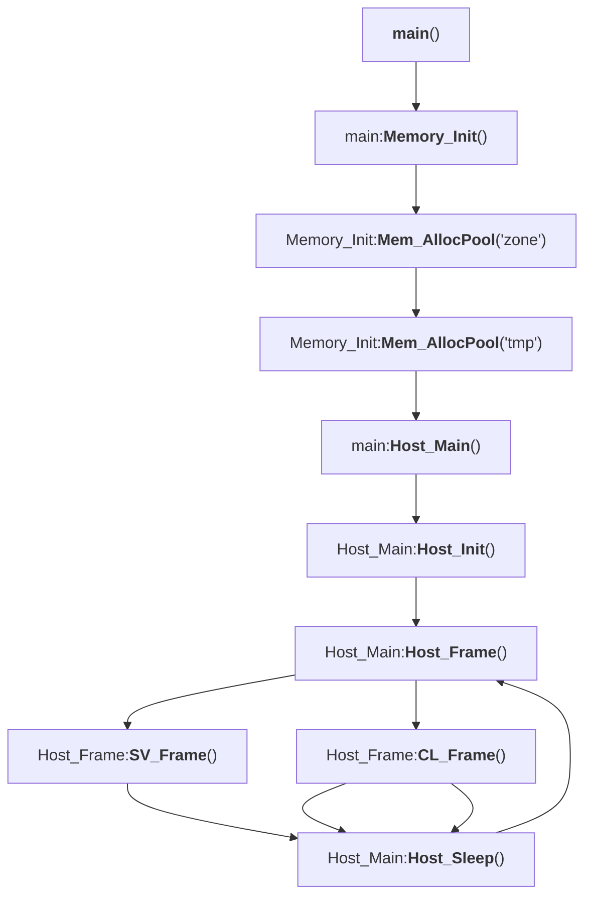

```mermaid
flowchart TB

    main["`**main**()`"] --> Memory_Init["`main:**Memory_Init**()`"]

    Memory_Init --> Mem_AllocPool1["`Memory_Init:**Mem_AllocPool**('zone')`"]
    Mem_AllocPool1 --> Mem_AllocPool2["`Memory_Init:**Mem_AllocPool**('tmp')`"]

    Mem_AllocPool2 --> Host_Main["`main:**Host_Main**()`"]

    Host_Main --> Host_Init["`Host_Main:**Host_Init**()`"]

    Host_Init --> Host_Frame["`Host_Main:**Host_Frame**()`"]

    Host_Frame --> SV_Frame["`Host_Frame:**SV_Frame**()`"]
    Host_Frame --> CL_Frame["`Host_Frame:**CL_Frame**()`"]

    SV_Frame --> Host_Sleep["`Host_Main:**Host_Sleep**()`"]
    CL_Frame --> Host_Sleep

    CL_Frame --> 

    Host_Sleep --> Host_Frame["`Host_Main:**Host_Frame**()`"]
```
